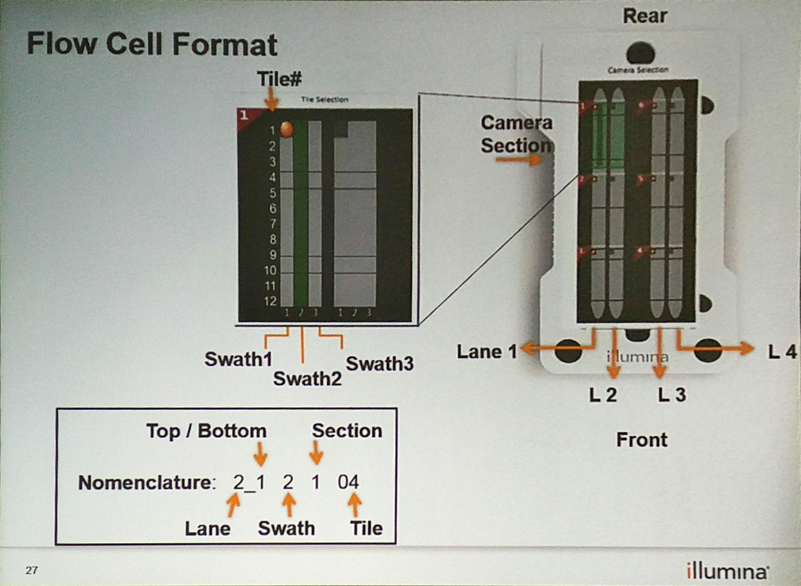

## NextSeq 500的flowcell结构

在文件RunInfo.xml里面，有关于NextSeq500 flowcell的描述：

` <FlowcellLayout LaneCount="4" SurfaceCount="2" SwathCount="3" TileCount="12" SectionPerLane="3" LanePerSection="2"> `

可以理解为：

* 一个flow有4条lane，每个lane都有上下2个表面，每个lane有三个section（对应三个相机，同时对两条lane拍照需要六个相机），每个section有三个swath，每个swath有12个lane。

* 总共的tile数目为：4 lane X 2 surface X 3 section X 3 swath X 12 tile = 864 tiles

* 而每个tile所得的reads数目为470k （filtered）左右，所以一个nextseq 500的flowcell可得reads 数目为470k * 864 ~= 400M 左右

