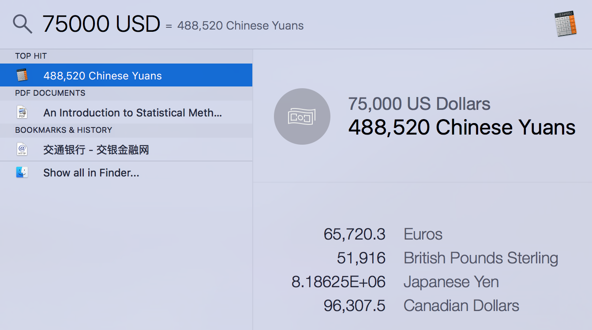

## quicksilver 和spotlight search

很多人推荐alfred，据说付费版有很多高级的功能，我估计自己也用不到。alfred的免费版，我觉得没有quicksilver好，关键一点在于后者可以查找程序（app）的alias，前者不行，其它方面没有显著性差别。

另外，其实spotlight search的功能更强大，可以查找所有的程序、文件，还能做计算，甚至货币转换：


	
## 输入法

不要用什么狗屁搜狗输入法，各种弹窗和广告。

自带的输入法已经足够好了:
* 只需要适应一下选词的时候右手用`{`和`}`翻页，左手用数字键（只有`1-6`，估计是考虑到左手）选择即可。
* 唯一不好的地方在于输入中文的时候，不能用`shift`键快速进入英文输入模式。

## 把F1-F12 还原为标准功能键

默认情况下，Mac键盘上F1-F12都是特殊功能，相当于｀Fn + F1-F12`，比如调节声音。于是当需要真正的标准F1-F12 时，需要同时按住下Fn，这是非常不方便的。

把F1-F12还原为标准功能键：

选择`System Preferences` -> `Keyboard`，在Keyboard标签页中选中`Use all F1, F2, etc. keys as standard function keys`。

## 触摸板的设置

* 使用四指代替三指

选择`System Preferences` -> `TrackPad` -> `More Guestures`, 所有使用三指的都选择用四指。

* 使用三指拖动和选择

选择`System Preferences` -> `Accessibility` -> `Mouse & TrackPad` -> `TrackPad Options`, `Enable Dragging` 选择`three finger drag`。

## 使用zsh代替bash

bash很好，但是zsh更好。

```
$ which zsh
/bin/zsh
# make sure /bin/zsh is in file "/etc/shells"
$ sudo chsh -s /
```

## 主机名(hostname)设置

在默认情况下，Mac每次连接到一个WIFI，计算机的主机名（hostname）都会被修改成WIFI热点的名字。其原因是Mac电脑的主机名没有被设置:
```
> username@bogon[s002] ~> scutil --get HostName 
> HostName: not set 
```

解决方法是手动指定hostname:

```
> username@bogon[s002] ~> sudo scutil --set HostName "new_hostname"  
> Password:  
> username@bogon[s002] ~> scutil --get HostName              
> new_hostname  
> username@bogon[s002] ~>  
```

## 启用locate

locate默认是不启动的，需要手动启动。

```
$ locate something

WARNING: The locate database (/var/db/locate.database) does not exist.
To create the database, run the following command:

  sudo launchctl load -w /System/Library/LaunchDaemons/com.apple.locate.plist

Please be aware that the database can take some time to generate; once
the database has been created, this message will no longer appear.

$ sudo launchctl load -w /System/Library/LaunchDaemons/com.apple.locate.plist
Password:
```


## 将Microsoft Outlook导出的.ost文件导入到Mac电脑上的mail.app

1. export mail in .ost file to mbox file (the file may not end with .mbox).  

    ```readpst -j 3 outlook.ost```

2. mail.app --> File --> import mailboxes, and select the folder generated in step 1.

That's all. Your emails in the ost file will be imported into a directory under "on my Mac".


## run job with at on Mac

"at" on Mac is run by atrun, which is invoked by launchd. The problem is atrun is not running by default.

```
The atrun utility runs commands queued by at(1).  It is invoked periodically by launchd(8) as specified in the com.apple.atrun.plist property list.  By default the property list contains the Disabled key set to true, so atrun is never invoked.

Execute the following command as root to enable atrun:  
    launchctl load -w /System/Library/LaunchDaemons/com.apple.atrun.plist
```

After that, you can use "at" to submit job on Mac.


## disable local backup of timemachine

Mac的时光机（timemachine）默认会在本地硬盘有一份实时备份的缓存，用来储存自从上次备份之后到现在的变动情况，所占的空间可能会比较大。假如不想保留本地缓存，可以使用tmutil进行开关。

* Finder -> goto "/Volumes" will see a backup disk

* "sudo tmutil disablelocal" will disable local cache of time machine

* "sudo tmutil enablelocal" will enable it again


## 大小写敏感 - case insenstivity on MAC OS X

Mac默认的文件系统HFS+在显示的时候是保留了大小写之分的，但是在实际使用中是不区别大小写的，但是假如使用了UFS（Unix FileSyste），那么和大部分的Unix操作系统一样是严格区分大小写的。

```
http://apple.stackexchange.com/questions/22297/is-bash-in-osx-case-insensitive

	HFS+ (the Mac filesystem) is usually configured to be case insensitive but case preserving. This means that the file system will consider foo and FoO to be the same, but when you create a new file it will remember which letters where capitalized and which were not.
	
	When you format a disk with HFS+ you can chose whether the file system should case sensitive or not. If you chose to format with UFS (Unix FileSystem) it is always case sensitive, AFAIK.
	
	To check whether a disk is case sensitive, run:
	
	diskutil info <device>
	
	For example:
	
	diskutil info disk0s2
	
	Look for the Name: line. If it reads something like Mac OS Extended (Case-sensitive, Journaled) it means that it is case-sensitive. If it just reads Mac OS Extended (without the Case-sensitive) then it is only case preserving but not case sensitive.
```

我的电脑上的情况是这样的(显示大小写的区别，但是不区分大小写):

```
> diskutil info /dev/disk1 | grep Name
Device / Media Name:      Macintosh HD
Volume Name:              Macintosh HD
Name (User Visible):      Mac OS Extended (Journaled)
>
```

## 使用brew安装Macvim

当使用conda安装python之后，再使用brew安装macvim（```brew install macvim```）会出错，其原因在于berw安装的macvim需要Mac自带的python（framework python）。

所以在安装或更新macvim的时候，需要：

1. 新开一个terminal窗口，运行 

    ```export PATH=/System/Library/Frameworks/Python.framework/Versions/2.7/bin:$PATH```

   但是不要把这一行加入到启动配置文件（.bashrc或者.zshrc）。

2. 安装或者更新macvim

    ```brew install macvim``` or ```brew upgrade macvim```

3. close the terminal, so your `$PATH` will restore to default.

## 直接安装macvim

当系统上使用anconda安装python之后，使用brew安装macvim有些麻烦，容易出错，最可靠的还是直接到macvim网站下载二进制安装包安装。

```http://macvim-dev.github.io/macvim/```

安装只需要将MacVim.app拖到/Applications里面去，另外，把“mvim”放到环境变量PATH能找到的地方去就可以在命令行里面使用mvim启动MacVim了。
